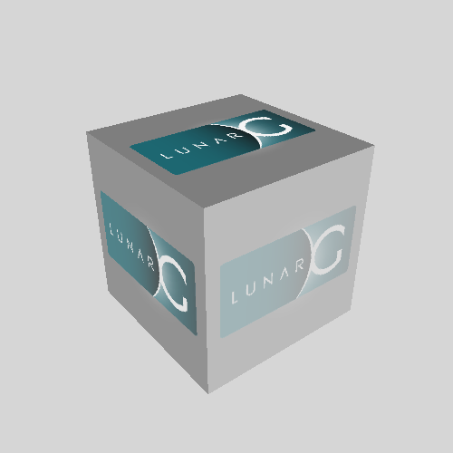

# renderdoc-mcp
[](https://github.com/JiaboLi-GitHub/renderdoc-mcp/actions/workflows/release.yml)
**English** | [中文](README-CN.md)

MCP (Model Context Protocol) server for GPU render debugging. Enables AI assistants (Claude, Codex, etc.) to analyze RenderDoc capture files (.rdc) through a standard MCP interface.

## Features

- **52 MCP tools** covering the full GPU debugging workflow
- **CLI tool** (`renderdoc-cli`) for scripting and shell-based workflows
- Open and analyze `.rdc` capture files (D3D11 / D3D12 / OpenGL / Vulkan)
- **Live capture**: launch an application with RenderDoc injected, capture a frame, and auto-open it
- List draw calls, events, render passes with filtering
- Inspect pipeline state, shader bindings, resource details
- Get shader disassembly and reflection data, search across shaders
- Export textures, buffers, and render targets as PNG/binary
- Performance stats, debug/validation log messages
- Automatic parameter validation with proper JSON-RPC error codes
- **Frame diff engine**: compare two captures side-by-side — draw sequences, pipeline state, resources, per-pass stats, and pixel-level framebuffer diff
- **Layered architecture**: core library shared by MCP server, CLI, and AI skill

## Prerequisites

- **Windows** (MSVC compiler with C++17)
- **CMake** >= 3.16
- **RenderDoc** source code and build output (`renderdoc.lib` + `renderdoc.dll`)

## Download

Prebuilt Windows x64 binaries can be downloaded from the [GitHub Releases](https://github.com/JiaboLi-GitHub/renderdoc-mcp/releases) page.

Each release zip includes:

Current package layout:

- `bin/renderdoc-mcp.exe` — MCP server
- `bin/renderdoc-cli.exe` — command-line tool
- `bin/renderdoc.dll`, `bin/renderdoc.json`, and the extra RenderDoc runtime DLLs needed beside the executables
- `skills/renderdoc-mcp/` — Codex skill
- `install-codex.ps1` — install the MCP server, skill, and CLI into Codex
- `README.md`, `README-CN.md`, and license files

Legacy flat summary from older releases:

- `renderdoc-mcp.exe` — MCP server
- `renderdoc-cli.exe` — command-line tool
- `renderdoc.dll`
- the extra RenderDoc runtime DLLs needed beside the executable
- license files

Keep the package directory layout intact after extracting the zip.

As of `v0.2.1`, the extracted release keeps executables under `bin/`, ships the Codex skill under `skills/renderdoc-mcp/`, and includes `install-codex.ps1` for Codex setup.

## Install in Codex

Run the installer from the extracted release directory:

```powershell
powershell -ExecutionPolicy Bypass -File .\install-codex.ps1
```

The installer:

- installs the package under `~/.codex/vendor_imports/renderdoc-mcp`
- registers an MCP server named `renderdoc-mcp` in `~/.codex/config.toml`
- installs the skill to `~/.codex/skills/renderdoc-mcp`
- adds the release `bin/` directory to the user `PATH` so `renderdoc-cli` is available in shells and from the skill

Restart Codex Desktop after installation.

For Vulkan live capture, `capture_frame` points the child process at the packaged `bin/renderdoc.json` and `bin/renderdoc.dll` so capture and replay use the same RenderDoc runtime. Avoid launching the target with elevated privileges because the Vulkan loader ignores layer-path overrides for elevated processes.

## Build

```bash
# Basic (auto-detect renderdoc build output)
cmake -B build -DRENDERDOC_DIR=D:/renderdoc/renderdoc
cmake --build build --config Release

# Explicit build directory
cmake -B build \
  -DRENDERDOC_DIR=D:/renderdoc/renderdoc \
  -DRENDERDOC_BUILD_DIR=D:/renderdoc/renderdoc/x64/Development
cmake --build build --config Release
```

### CMake Variables

| Variable | Required | Description |
|----------|----------|-------------|
| `RENDERDOC_DIR` | Yes | Path to renderdoc source root |
| `RENDERDOC_BUILD_DIR` | No | Path to renderdoc build output (if not in standard locations) |

Build output: `build/Release/renderdoc-mcp.exe` and `build/Release/renderdoc-cli.exe`

Ensure `renderdoc.dll` and `renderdoc.json` are in the same directory as the executables. CMake will copy both automatically if found.
When using the official RenderDoc Visual Studio solution on Windows, `RENDERDOC_BUILD_DIR` typically points at `.../x64/Development`.

## Client Configuration

### Claude Code

Add to your Claude Code MCP settings (`settings.json`):

```json
{
  "mcpServers": {
    "renderdoc-mcp": {
      "command": "C:/Users/your-user/.codex/vendor_imports/renderdoc-mcp/bin/renderdoc-mcp.exe",
      "args": []
    }
  }
}
```

### Codex / Other MCP Clients

For Codex, the release installer writes this MCP configuration to `~/.codex/config.toml`:

```toml
[mcp_servers.renderdoc-mcp]
command = 'C:\Users\your-user\.codex\vendor_imports\renderdoc-mcp\bin\renderdoc-mcp.exe'
args = []
```

Any MCP client that supports stdio transport can use renderdoc-mcp. Point it to the packaged `bin/renderdoc-mcp.exe`.

## Demo

Example user-facing interaction with the bundled `tests/fixtures/vkcube.rdc` sample:

```text
User: What information is inside vkcube.rdc?

AI: I inspected the capture through renderdoc-mcp. Here's a quick summary:

- It is a Vulkan capture with 6 events and 1 draw call.
- The main draw call is `vkCmdDraw()` at event 11, drawing 36 indices with 1 instance.
- At that event, the pipeline uses vertex shader `ResourceId::111` and fragment shader `ResourceId::112`, both with entry point `main`.
- The active render target is `ResourceId::130` in `R8G8B8A8_UNORM`, with a 500x500 viewport.
- The VS stage has a constant buffer `ubuf` (1216 bytes, 3 variables), and the PS stage reads a texture `tex` at bind point 1.
- The capture also includes a 256x256 `R8G8B8A8_SRGB` texture (`ResourceId::97`) and a 500x500 `D16` depth attachment (`ResourceId::153`).
- The capture log is clean: no debug/validation messages were reported.

If you want, I can also export the render target, inspect shader reflection, or list more resources.
```

Behind that answer, the AI can drive the MCP server with calls like:

```text
open_capture({"path":"D:/renderdoc/renderdoc-mcp/tests/fixtures/vkcube.rdc"})
get_capture_info({})
list_draws({"limit":10})
goto_event({"eventId":11})
get_pipeline_state({})
get_bindings({})
list_resources({"type":"Texture"})
get_log({})
```

The same workflow can export the rendered result from event `11`:



## CLI Tool

`renderdoc-cli` provides direct command-line access to RenderDoc analysis, useful for scripting, CI, and shell workflows.

After running `install-codex.ps1`, the release `bin/` directory is added to your user `PATH`, so `renderdoc-cli` can be invoked directly from new shells.

```bash
# Capture a frame from a running application
renderdoc-cli capture MyApp.exe -d 120 -o capture.rdc

# Inspect a capture
renderdoc-cli capture.rdc info
renderdoc-cli capture.rdc events --filter Draw
renderdoc-cli capture.rdc draws
renderdoc-cli capture.rdc pipeline -e 42
renderdoc-cli capture.rdc shader ps -e 42
renderdoc-cli capture.rdc resources --type Texture
renderdoc-cli capture.rdc export-rt 0 -o ./output -e 42
```

### CLI Commands

| Command | Description |
|---------|-------------|
| `capture EXE [opts]` | Launch app with RenderDoc injected, capture a frame |
| `info` | Print capture metadata (API, GPU, driver, total event/draw counts) |
| `events [--filter TEXT]` | List all events with optional name filter |
| `draws [--filter TEXT]` | List draw calls |
| `pipeline [-e EID]` | Dump pipeline state at event |
| `shader STAGE [-e EID]` | Print shader disassembly (`vs`/`hs`/`ds`/`gs`/`ps`/`cs`) |
| `resources [--type TYPE]` | List resources by type filter |
| `export-rt IDX -o DIR [-e EID]` | Export render target to directory |
| `pass-stats` | Per-pass statistics (JSON) |
| `pass-deps` | Pass dependency DAG (JSON) |
| `unused-targets` | Unused render target detection (JSON) |
| `diff captureA captureB [opts]` | Compare two captures (draws, pipeline, resources, framebuffer) |

## Tools (52)

### Session

| Tool | Description |
|------|-------------|
| `open_capture` | Open a `.rdc` file for analysis. Returns API type and total event/draw counts. |

### Events & Draws

| Tool | Description |
|------|-------------|
| `list_events` | List all events with optional name filter |
| `goto_event` | Navigate to a specific event by ID |
| `list_draws` | List draw calls with vertex/index counts, instance counts |
| `get_draw_info` | Get detailed info about a specific draw call |

### Pipeline & Bindings

| Tool | Description |
|------|-------------|
| `get_pipeline_state` | Get pipeline state (shaders, RTs, viewports). Supports optional `eventId` param. |
| `get_bindings` | Get per-stage resource bindings (CBV/SRV/UAV/samplers) from shader reflection |

### Shaders

| Tool | Description |
|------|-------------|
| `get_shader` | Get shader disassembly or reflection data for a stage (`vs`/`hs`/`ds`/`gs`/`ps`/`cs`) |
| `list_shaders` | List all unique shaders with stage and usage count |
| `search_shaders` | Search shader disassembly text for a pattern |

### Resources

| Tool | Description |
|------|-------------|
| `list_resources` | List all GPU resources with type/name filtering |
| `get_resource_info` | Get detailed resource info (format, dimensions, byte size) |
| `list_passes` | List render passes (marker regions with draw calls) |
| `get_pass_info` | Get pass details including contained draw calls |
| `get_pass_attachments` | Query color and depth attachments for a render pass |
| `get_pass_statistics` | Per-pass aggregated statistics (draws, triangles, RT dimensions) |
| `get_pass_deps` | Inter-pass resource dependency DAG |
| `find_unused_targets` | Detect render targets written but never consumed |

### Export

| Tool | Description |
|------|-------------|
| `export_render_target` | Export current event's render target as PNG |
| `export_texture` | Export any texture by resource ID as PNG |
| `export_buffer` | Export buffer data to binary file |

### Info & Diagnostics

| Tool | Description |
|------|-------------|
| `get_capture_info` | Get capture metadata: API, GPUs, driver, total event/draw counts |
| `get_stats` | Performance stats: per-pass breakdown, top draws, largest resources |
| `get_log` | Debug/validation messages with severity and event filtering |

### Pixel & Debug

| Tool | Description |
|------|-------------|
| `pixel_history` | Query pixel modification history up to an event |
| `pick_pixel` | Read pixel RGBA value at an event |
| `debug_pixel` | Debug pixel/fragment shader with optional trace |
| `debug_vertex` | Debug vertex shader with optional trace |
| `debug_thread` | Debug compute shader thread with optional trace |
| `get_texture_stats` | Get texture min/max values and histogram |

### Capture

| Tool | Description |
|------|-------------|
| `capture_frame` | Launch app with RenderDoc injected, capture a frame, auto-open for analysis |

### Shader Hot-Editing

| Tool | Description |
|------|------------|
| `shader_encodings` | List supported shader compilation encodings |
| `shader_build` | Compile shader source, returns shaderId |
| `shader_replace` | Replace shader at event/stage with built shader |
| `shader_restore` | Restore single shader to original |
| `shader_restore_all` | Restore all shaders and free resources |

### Extended Export

| Tool | Description |
|------|------------|
| `export_mesh` | Export post-transform vertex data (OBJ/JSON) |
| `export_snapshot` | Export complete draw state (pipeline, shaders, RTs) |
| `get_resource_usage` | Track resource usage across events |

### CI Assertions

| Tool | Description |
|------|------------|
| `assert_pixel` | Validate pixel RGBA value with tolerance |
| `assert_state` | Validate pipeline state field value |
| `assert_image` | Compare two PNG images pixel-by-pixel |
| `assert_count` | Validate resource/draw/event counts |
| `assert_clean` | Validate no debug messages above severity |

### Diff / Comparison

| Tool | Description |
|------|------------|
| `diff_open` | Open two captures for side-by-side comparison (captureA, captureB) |
| `diff_close` | Close diff session and free resources |
| `diff_summary` | High-level diff summary with multi-level checking; includes `divergedAt` field |
| `diff_draws` | Compare draw call sequences using LCS alignment; reports changed/added/removed draws |
| `diff_resources` | Compare GPU resource lists between two captures |
| `diff_stats` | Compare per-pass statistics between two captures |
| `diff_pipeline` | Compare pipeline state at a matched draw (marker param) |
| `diff_framebuffer` | Pixel-level render target comparison (eidA, eidB, target, threshold, diffOutput) |

## Tool Details

### open_capture

**Parameters:**

| Name | Type | Required | Description |
|------|------|----------|-------------|
| `path` | string | Yes | Absolute path to the `.rdc` file |

**Response:**
```json
{ "api": "D3D12", "totalEvents": 1247, "totalDraws": 312 }
```

---

### list_draws

**Parameters:**

| Name | Type | Required | Description |
|------|------|----------|-------------|
| `filter` | string | No | Filter by name keyword |
| `limit` | integer | No | Max results (default 1000) |

**Response:**
```json
{
  "draws": [
    { "eventId": 42, "name": "DrawIndexed(360)", "flags": "Drawcall|Indexed", "numIndices": 360, "numInstances": 1, "drawIndex": 0 }
  ],
  "count": 1
}
```

---

### get_shader

**Parameters:**

| Name | Type | Required | Description |
|------|------|----------|-------------|
| `stage` | string | Yes | Shader stage: `vs`, `hs`, `ds`, `gs`, `ps`, `cs` |
| `eventId` | integer | No | Event ID (uses current if omitted) |
| `mode` | string | No | `disasm` (default) or `reflect` |

**Response (disasm):**
```json
{ "stage": "ps", "eventId": 42, "disassembly": "ps_5_0\ndcl_globalFlags..." }
```

**Response (reflect):**
```json
{
  "stage": "ps",
  "inputSignature": [...],
  "constantBlocks": [...],
  "readOnlyResources": [...],
  "readWriteResources": [...]
}
```

---

### get_pipeline_state

**Parameters:**

| Name | Type | Required | Description |
|------|------|----------|-------------|
| `eventId` | integer | No | Event ID to inspect (uses current if omitted) |

**Response (D3D12 example):**
```json
{
  "api": "D3D12",
  "eventId": 42,
  "vertexShader": { "resourceId": "ResourceId::15", "entryPoint": "VSMain" },
  "pixelShader": { "resourceId": "ResourceId::16", "entryPoint": "PSMain" },
  "renderTargets": [{ "index": 0, "resourceId": "ResourceId::7", "format": "R8G8B8A8_UNORM" }],
  "viewports": [{ "x": 0.0, "y": 0.0, "width": 1920.0, "height": 1080.0 }]
}
```

> For OpenGL and Vulkan captures, the pixel shader key is `fragmentShader`.

---

### get_bindings

**Parameters:**

| Name | Type | Required | Description |
|------|------|----------|-------------|
| `eventId` | integer | No | Event ID (uses current if omitted) |

**Response:**
```json
{
  "api": "D3D12",
  "stages": {
    "vs": {
      "shader": "ResourceId::15",
      "bindings": {
        "constantBuffers": [{ "name": "CBScene", "bindPoint": 0, "byteSize": 256 }],
        "readOnlyResources": [{ "name": "diffuseMap", "bindPoint": 0 }]
      }
    }
  }
}
```

---

### list_resources

**Parameters:**

| Name | Type | Required | Description |
|------|------|----------|-------------|
| `type` | string | No | Filter by type: `Texture`, `Buffer`, `Shader`, etc. |
| `name` | string | No | Filter by name keyword |

**Response:**
```json
{
  "resources": [
    { "resourceId": "ResourceId::7", "name": "SceneColor", "type": "Texture", "format": "R8G8B8A8_UNORM", "width": 1920, "height": 1080 }
  ],
  "count": 1
}
```

---

### export_texture

**Parameters:**

| Name | Type | Required | Description |
|------|------|----------|-------------|
| `resourceId` | string | Yes | Resource ID (e.g. `ResourceId::123`) |
| `mip` | integer | No | Mip level (default 0) |
| `layer` | integer | No | Array layer (default 0) |

---

### export_buffer

**Parameters:**

| Name | Type | Required | Description |
|------|------|----------|-------------|
| `resourceId` | string | Yes | Resource ID |
| `offset` | integer | No | Byte offset (default 0) |
| `size` | integer | No | Byte count, 0 = all (default 0) |

---

### get_log

**Parameters:**

| Name | Type | Required | Description |
|------|------|----------|-------------|
| `level` | string | No | Minimum severity: `HIGH`, `MEDIUM`, `LOW`, `INFO` |
| `eventId` | integer | No | Filter by event ID |

---

### capture_frame

**Parameters:**

| Name | Type | Required | Description |
|------|------|----------|-------------|
| `exePath` | string | Yes | Absolute path to the target executable |
| `workingDir` | string | No | Working directory (defaults to exePath's parent) |
| `cmdLine` | string | No | Command line arguments for the target |
| `delayFrames` | integer | No | Frames to wait before capturing (default 100) |
| `outputPath` | string | No | Path for the `.rdc` file (default: auto-generated in temp) |

**Response:**
```json
{
  "api": "D3D12",
  "totalEvents": 1247,
  "totalDraws": 312,
  "path": "C:/Users/.../capture_frame_2025.rdc"
}
```

## Typical Workflow

### Analyze an existing capture

```
1. open_capture        → Open a .rdc file
2. get_capture_info    → Check API, GPU, total event/draw counts
3. list_draws          → Find draw calls of interest
4. goto_event          → Navigate to a draw call
5. get_pipeline_state  → Inspect shaders, render targets, viewports
6. get_bindings        → See resource bindings per shader stage
7. get_shader          → Read shader disassembly or reflection
8. export_render_target → Save render target as PNG
9. get_log             → Check for validation errors
```

### Capture and analyze a live application

```
1. capture_frame       → Launch app, inject RenderDoc, capture frame, auto-open
2. list_draws          → Find draw calls of interest
3. goto_event          → Navigate to a draw call
4. get_pipeline_state  → Inspect shaders, render targets, viewports
5. export_render_target → Save render target as PNG
```

## Protocol Details

| Property | Value |
|----------|-------|
| Transport | stdio (stdin/stdout) |
| Message format | Newline-delimited JSON-RPC 2.0 |
| MCP version | 2025-03-26 |
| Batch support | Yes (receive); `initialize` forbidden in batch |
| Logging | stderr |

## Architecture

```
AI Client (Claude/Codex)              Shell / CI
    |                                     |
    | stdin/stdout (JSON-RPC)             | command line
    |                                     |
renderdoc-mcp.exe                    renderdoc-cli.exe
    ├── McpServer (protocol)              |
    ├── ToolRegistry (validation)         |
    └── tools/*.cpp (52 tools)            |
         |                                |
         +---------- core library --------+
         |   session, events, pipeline,   |
         |   shaders, resources, export,  |
         |   capture, info, errors        |
         |                                |
         | C++ dynamic linking            |
         |                                |
      renderdoc.dll + renderdoc.json (Replay API + Vulkan capture layer manifest)
```

Four-layer architecture: **core** (pure C++ library) → **MCP server** (protocol + 52 tools) / **CLI** (command-line) / **skill** (AI workflow patterns). Single-process, single-threaded. One capture session at a time (plus one diff session). ToolRegistry provides automatic `inputSchema` validation with proper JSON-RPC `-32602` error responses.

## Manual Testing

```bash
# Initialize
echo '{"jsonrpc":"2.0","id":1,"method":"initialize","params":{"protocolVersion":"2025-03-26","capabilities":{},"clientInfo":{"name":"test","version":"1.0"}}}' | renderdoc-mcp.exe

# List tools
echo '{"jsonrpc":"2.0","id":2,"method":"tools/list"}' | renderdoc-mcp.exe
```

## License

This project is licensed under the [MIT License](LICENSE).

RenderDoc itself is licensed under its own terms. See [renderdoc license](https://github.com/baldurk/renderdoc/blob/v1.x/LICENSE.md).
